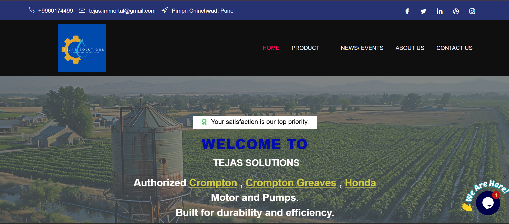
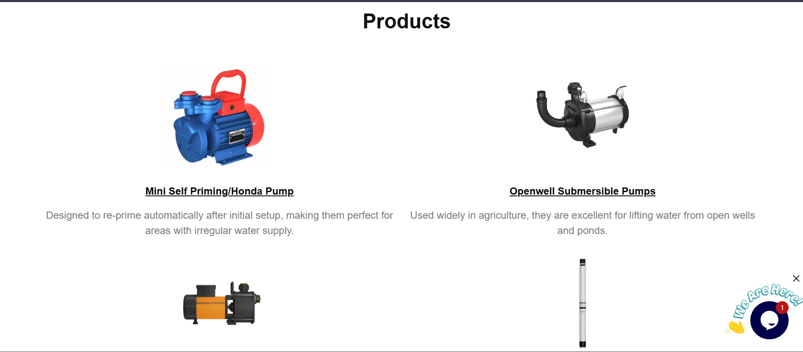
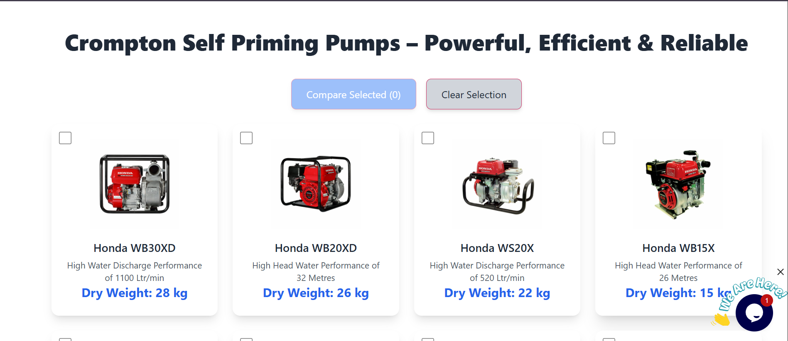
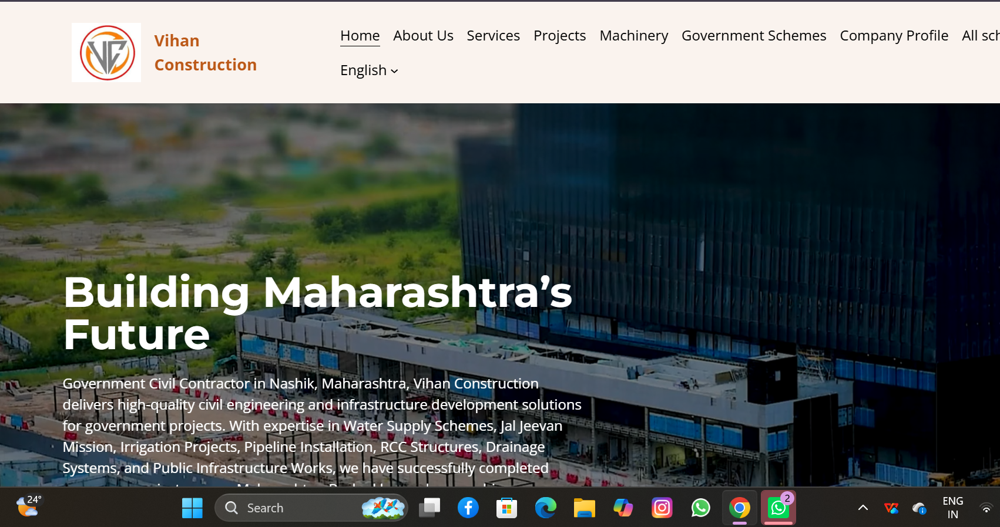
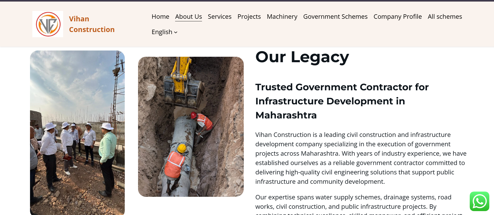
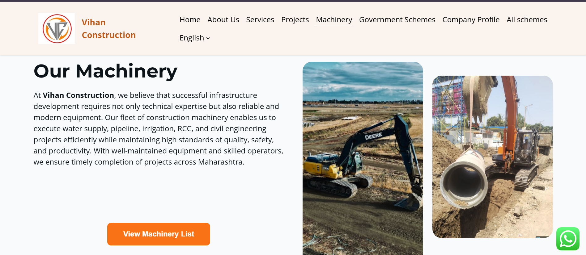
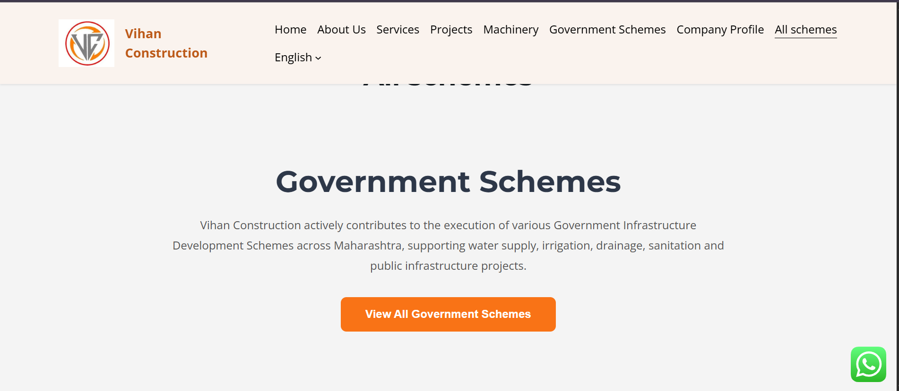

# CloudCrafter — Web Development & Digital Marketing

Welcome to CloudCrafter, a web development and digital marketing portfolio by Sonal Bhalerao.

## About Me

I am Sonal Bhalerao, a web developer and designer specializing in WordPress, HTML, CSS, website design, SEO, and digital marketing.

Through CloudCrafter, I help businesses build a professional online presence with modern websites and effective digital marketing solutions.

## Services

- WordPress Website Development
- Responsive Website Design
- HTML & CSS Development
- Search Engine Optimization (SEO)
- Social Media Management
- Meta Ads Campaigns
- Landing Page Design

## Featured Projects

## Tejas Solutions — Website Project

Professional website developed by CloudCrafter for Tejas Solutions, a Crompton pumps and motors dealership in Pune.

### Website Preview

### Project Highlights

- Professional WordPress website
- Responsive website design
- Product and service presentation
- SEO optimization
- Developed by CloudCrafter

### Technologies Used

- WordPress
- Elementor
- HTML & CSS
- SEO

### Live Website

[Visit Tejas Solutions Website](ADD-YOUR-LIVE-WEBSITE-LINK-HERE)

### 2. Rushali Dive Makeover
Professional beauty salon and makeup academy website designed and developed for Rushali Dive, Celebrity Makeup Artist & Beauty Educator in Nashik.
### Website Preview

- Website: (https://rushalidivemakeover.co.in/)
- Technologies: WordPress, Elementor, Responsive Design

### 3. Vihan Construction

## Vihan Construction — Website Project

Professional website developed by CloudCrafter for Vihan Construction, a government civil contractor in Nashik.

### Website Screenshots

### Technologies Used

- WordPress
- Elementor
- HTML & CSS
- Responsive Web Design
- SEO

### Live Website

https://vihanconstructions.in

### 4. Devsane Gram Panchayat
Bilingual Marathi and English Gram Panchayat website.

- Website: Add your live website link
- Technologies: WordPress, HTML, CSS, Bilingual Website

## Skills

WordPress | Elementor | HTML | CSS | SEO | Meta Ads | Canva

## Contact

For website development and digital marketing services, connect with me through CloudCrafter.
